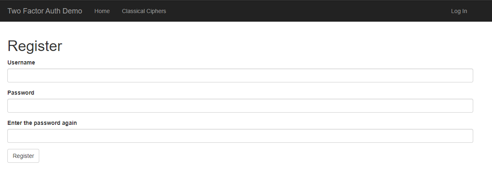
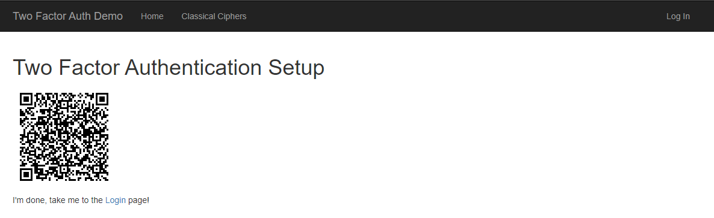
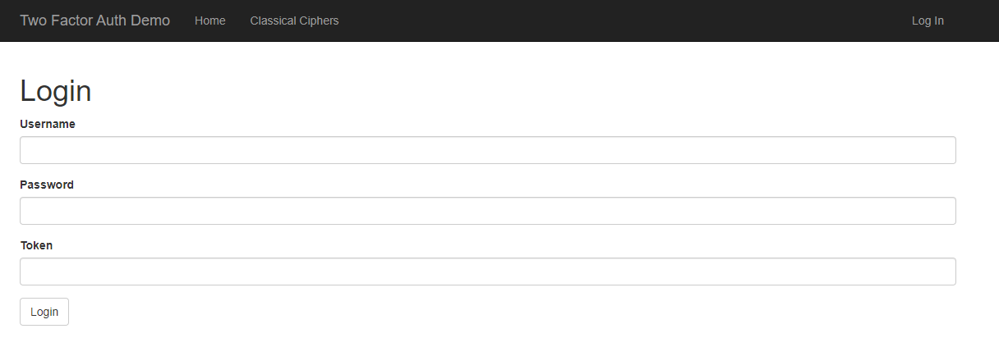
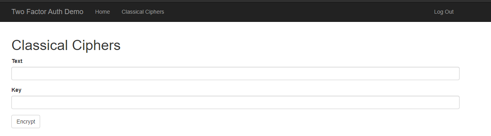

# CRYPTOGRAPHY AND SECURITY LABORATORY WORK 5

## TOPIC: Web Authentication & Authorisation.

### Course: Cryptography & Security
### Author: Vasile Drumea

<hr/>

## HOW TO RUN

Clone the current repository.

```bash
$ git clone https://github.com/IuraCPersonal/cs
```

Inside the current folder run:

```bash
$ pip install -r requirements.txt
```

And the start the Flask application:

```bash
$ python manage.py
 * Running on http://127.0.0.1:5000/
 * Restarting with reloader
```

Go on `http://localhost:5000`.

## THEORY

Authentication & authorization are 2 of the main security goals of IT systems and should not be used interchangibly. Simply put, during authentication the system verifies the identity of a user or service, and during authorization the system checks the access rights, optionally based on a given user role.

There are multiple types of authentication based on the implementation mechanism or the data provided by the user. Some usual ones would be the following:

- Based on credentials (Username/Password);
- Multi-Factor Authentication (2FA, MFA);
- Based on digital certificates;
- Based on biometrics;
- Based on tokens.

Regarding authorization, the most popular mechanisms are the following:

- Role Based Access Control (RBAC): Base on the role of a user;
- Attribute Based Access Control (ABAC): Based on a characteristic/attribute of a user.

## OBJECTIVES

1. Take what you have at the moment from previous laboratory works and put it in a web service / serveral web services.
2. Your services should have implemented basic authentication and MFA (the authentication factors of your choice).
3. Your web app needs to simulate user authorization and the way you authorise user is also a choice that needs to be done by you.
4. As services that your application could provide, you could use the classical ciphers. Basically the user would like to get access and use the classical ciphers, but they need to authenticate and be authorized.

## IMPLEMENTATION DESCRIPTION

First thing first, I started by creating the Users Model for the `Database`. For each user a __username__ and a __password_hash__ will be stored.

```python
class User(UserMixin, db.Model):
    __tablename__ = 'users'

    id = db.Column(db.Integer, primary_key=True)
    username = db.Column(db.String(32), index=True)
    password_hash = db.Column(db.String(128))
    otp_secret = db.Column(db.String(16))  # One-time password
```

For security reasons the original password will not be stored, after the hash is calculated during registration it will be discarded.

Next, let's handle the user's information.

To create the password hashes I'm going to use PassLib, a package dedicated to password hashing.

```python
@password.setter
def password(self, password):
    self.password_hash = generate_password_hash(password=password)
```

The `verify_password()` method takes a plain password as argument and returns `True` if the password is correct or `False` otherwise.

### Handling User Registration

In this project, a client can register a new user by completing the `User Registration Form`. It requires an unique `username` and entering your `password` two times. 

In case the user already exists, the password is too short or the password is not the same in both fields - a error will be thrown and the page will refresh.

```python
class RegistrationForm(FlaskForm):
    username = StringField('Username', validators=[DataRequired(), Length(1, 64)])
    password = PasswordField('Password', validators=[DataRequired()])
    second_password = PasswordField('Enter the password again', validators=[DataRequired(), EqualTo('password')])
    
    submit = SubmitField('Register')
```

And here are the results:



The implementation of the Flask route is shown below:

```python
@app.route('/register', methods=['POST', 'GET'])
def register():
    if current_user.is_authenticated:
        return redirect(url_for('index'))
    
    form = RegistrationForm()

    if form.validate_on_submit():
        user = User.query.filter_by(username=form.username.data).first()

        if user is not None:
            flash('Username Already Exists.')
            return redirect(url_for('register'))
        
        user = User(username=form.username.data, password=form.password.data)

        db.session.add(user)
        db.session.commit()

        session['username'] = user.username

        return redirect(url_for('two_factor_setup'))

    return render_template('register.html', form=form)
```

### Handling 2FA

There are many one-time password algorithms, most are proprietary, but there are a few open standards, of which HOTP and TOTP are the most commonly used.

The one I used is `TOTP` algorithm, short for Time-based One-time Password. This standard also uses a shared secret, but deals away with the counter, which is replaced by the current time. With this algorithm the token changes at a predefined time interval, usually every 30 seconds.

Secret keys may be encoded in QR codes as a URI with the following format:

```
otpauth://TYPE/LABEL?PARAMETERS
```

```python
def get_totp_uri(self):
    # 👇 https://github.com/google/google-authenticator/wiki/Key-Uri-Format
    return f'otpauth://totp/2FADemo:{self.username}?secret={self.otp_secret}&issuer=2FADemo'
```

Here is the Flask route implementation:

```python
@app.route('/2FA')
def two_factor_setup():
    if 'username' not in session:
        return redirect(url_for('index'))

    user = User.query.filter_by(username=session['username']).first()

    if user is None:
        return redirect(url_for('index'))

    return render_template('two-factor-setup.html'), 200, {
        'Cache-Control': 'no-cache, no-store, must-revalidate',
        'Pragma': 'no-cache',
        'Expires': '0'
    }
```

And with the help of `pyqrcode`, I managed to have a **QR Code** to be shown on the page.



Next, I downloaded the `FreeOTP` and scaned the QR Code and voila, my account had a TOTP linked to it.

Now, everytime I want to log in to my accound, a Token will be requested.



Here is the implementation and form for the `Login` page and route.

```python
class LoginForm(FlaskForm):
    username = StringField('Username', validators=[DataRequired(), Length(1, 64)])
    password = PasswordField('Password', validators=[DataRequired()])
    token = StringField('Token', validators=[DataRequired(), Length(6, 6)])

    submit = SubmitField('Login')
```

```python
@app.route('/login', methods=['GET', 'POST'])
def login():
    if current_user.is_authenticated:
        return redirect(url_for('index'))

    form = LoginForm()

    if form.validate_on_submit():
        user = User.query.filter_by(username=form.username.data).first()

        if user is None or user.verify_password(form.password.data) == False or \
            not user.verify_totp(form.token.data):
            flash('Wrong username, password or token. Check again!')
            return redirect(url_for('login'))
        
        login_user(user=user)
        flash(f'Welcome, {user.username}.')

        return redirect(url_for('index'))
    
    return render_template('login.html', form=form)
```

And if by any case the user wants to log out, there is an option to do so.

```python
@app.route('/logout')
def logout():
    logout_user()
    
    return redirect(url_for('index'))
```

### Adding the Encrypting Options

Next step was to add the option to encrypt the desired message with any available `cipher` algorithm.

To do so, I created a basic form asking for the `message`, `shift` if required and `key`.

```python
class CipherForm(FlaskForm):
    input = StringField('Text', validators=[DataRequired(), Length(1, 64)])
    key = StringField('Key', validators=[DataRequired(), Length(1, 64)])

    submit = SubmitField('Encrypt')
```

After submiting the form:



A redirection to the `Results` page will happen and the encrypted message will be there.

```python
@app.route('/result')
def result():
    message = request.args['message']
    
    return render_template('result.html', message=json.loads(message))


@app.route('/classicalciphers', methods=['POST', 'GET'])
def classicalciphers():
    if not current_user.is_authenticated:
        return redirect(url_for('index'))
    
    form = CipherForm()

    if form.validate_on_submit():
        encrypted = CaesarCipher.encrypt(form.input.data, int(form.key.data))
        message = json.dumps({'encrypted': encrypted})

        return redirect(url_for('result', message=message))
    return render_template('classical-ciphers.html', form=form)
```

**!NOTE** The options to encrypt are only available if you are **LOGGED IN**.

## CONCLUSION

During this laboratory work, I managed to create an Web Authentication & Authorisation application using `RESTful Authentication` with Flask and `Multi-Factor Authorisation` provided by `Red Hat`.